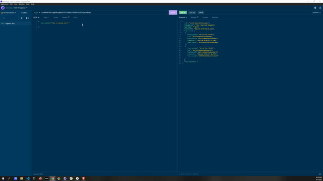

# SocialNetworkAPI

## Description
A backend for your social network. Allows user to post, update, and delete their thoughts. Other users/friends may react to those thoughts and add their own. 

## TOC
[How to Use](#how-to-use)  
[Video and Links](#videoandlinks)  
[References](#references)  
[Created By](#CreatedBy)  

## How to Use:
Start server using node server.js, run routes in insomnia

## Video and Links
link to repo: https://github.com/jacef790/SocialNetworkAPI 
link to users: https://drive.google.com/file/d/1NbFRK7A6zzyyE4XFLExiHzocddGasIAN/view?usp=sharingbr 
link to thoughts: https://drive.google.com/file/d/1Q7gwU7UBUjfEKvz4-CnetYVPc5vBULcD/view?usp=sharing 
link to reactions: https://drive.google.com/file/d/1Ujpi8kjrRm__mhdyG7Tm7exWMof-NuKJ/view?usp=sharing 

 

## References:
Module 18-NoSQL(Activity-28-student-mini-project), UTA Bootcamp 

JSON validation expecting 'EOF'. (n.d.). Stack Overflow. https://stackoverflow.com/questions/22151760/json-validation-expecting-eof

Mongoose v6.3.5:. (n.d.). Mongoose ODM v6.3.5. https://mongoosejs.com/docs/api/connection.html

## Created By:
Jace Feinstein, contact me at https://github.com/jacef790